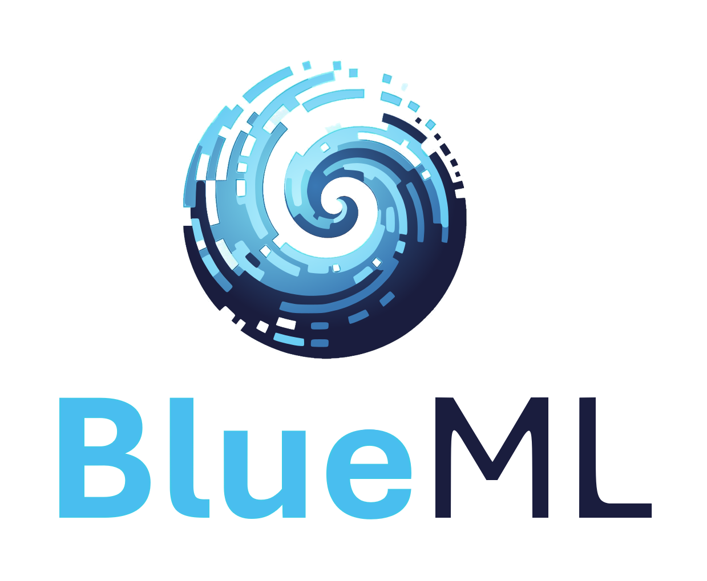
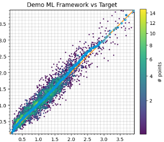
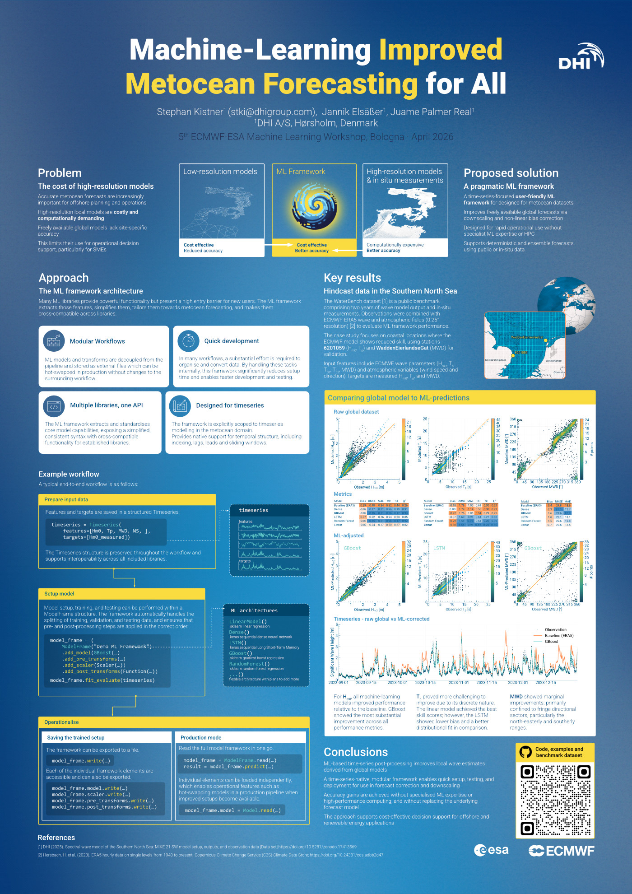

# BlueML: machine learning for metocean models  
## [🚧 Pre-release version - expect breaking changes 🛠️]


The library for finetuning your metocean model results to real world observations. 

## Getting Started

```bash
pip install git+https://github.com/DHI/blue_ml-preview.git
```

## Example Workflow

- [Notebook: Workflow quick start](./notebooks/WorkflowExample.ipynb)

Start by defining a `Timeseries` object with your data.

```python
import blue_ml
import pandas as pd
timeseries = blue_ml.Timeseries(
   features = pd.read_csv("coarse_model_data.csv")
   targets = pd.read_csv("observed_hm0.csv")
)
```

Setup a `ModelFrame` with your choice of data transformations and machine learning architecture.

```python
model_frame = (
    blue_ml.ModelFrame("Demo ML Framework")
    .add_model(blue_ml.machinelearning.architectures.BlueDense())
    .add_scaler(blue_ml.transforms.StandardScaler())
)
```

Fit and evaluate the model
```python
model_skill = model_frame.fit_evaluate(timeseries)
model_skill.plot_scatter()
```



## Publications



## License

This project is licensed under the MIT License - see the [LICENSE](LICENSE) file for details.

## Support

For questions, issues, or contributions, please visit our [GitHub repository](https://github.com/DHI/blue_ml-preview) or open an issue.  
